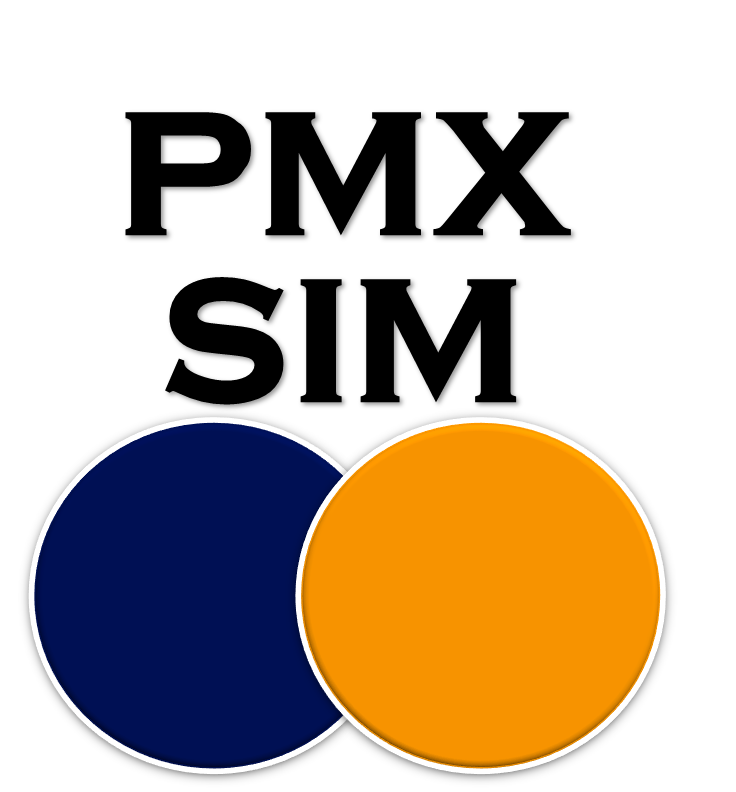

# PMX_Simulations repository by PMXSolutions.com
This Shiny application was created to assist in the simulation of pharmacokinetic profiles and the exploration of different dosing regimens.

The latest version of this repository is being hosted on shinyapps.io and visible on:
http://www.pmxsolutions.com/software/pmx-simulation-and-report-generation/

Due to the great functionality and ease-of-use, all simulations were based on mrgsolve. 

## Run application
Download, clone, or fork this repository to use the R code within your local R installation. 

Furthermore, the runGitHub command from the Shiny package can be used to immediately execute the latest version from within R:

`library(shiny)`

`runGitHub("PMX_Simulations", "michielve")`

## Add user table
The user can upload a dataset to the shiny application to be included in the PK profile. The requirements of this dataset is that it should include a DOSE column to match the colors with the simulated profiles.

An example can be found below and in the example folder:

| ID | TIME | CONCENTRATION | DOSE |
| :--: | :--: | :--: | :--: |
| 1  | 0    | 0 | 100 |
| 1  | 1 | 8 | 100|
| 1  | 2 | 13 | 100|
| 1  | 4 | 4 | 100|
| 2  | 0 | 0 | 100|
| 2  | 1 | 7 | 100|
| 2  | 2 | 10 | 100|
| 2  | 4 | 6 | 100|

## Required software
Make sure mrgsolve is installed and working on your computer:
https://github.com/metrumresearchgroup/mrgsolve/wiki/mrgsolve-Installation

In order to create the pdf report, make sure that you can knit documents. MiKTeX can be installed to enable this:
https://miktex.org/download

## Contribute
Feel free to use and improve this repository to include additional functionality. Report bugs in the issues section of this repository.

